# Project 1: User Lifecycle Management (Joiner / Mover / Leaver)

**Platform:** Microsoft Entra ID
**Scenario:** Meridian Health Partners (fictional healthcare organization)
**Date:** May 2026

End-to-end implementation of joiner, mover, and leaver workflows in Microsoft Entra ID. This project covers tenant setup, bulk workforce provisioning, department-based group structure, and the three core scenarios that define identity operations: onboarding a new hire, processing an internal role change, and offboarding a terminated employee. Every action is captured in the Entra audit log to demonstrate compliance-ready IAM work.

This is the first of ten projects in my IAM portfolio. The same fictional organization carries across all ten, so the work reads like a year of IAM analyst output at one healthcare company rather than ten disconnected labs.

---

## Table of Contents

- [The Organization](#the-organization)
- [Environment Setup](#environment-setup)
- [Baseline Workforce](#baseline-workforce)
- [Group Structure](#group-structure)
- [Joiner: Onboarding Emily Rodriguez](#joiner-onboarding-emily-rodriguez)
- [Mover: Promoting Jennifer Williams](#mover-promoting-jennifer-williams)
- [Leaver: Terminating Michael Brown](#leaver-terminating-michael-brown)
- [Audit Evidence](#audit-evidence)
- [Skills Demonstrated](#skills-demonstrated)
- [Lessons Learned](#lessons-learned)
- [Repository Contents](#repository-contents)

---

## The Organization

Meridian Health Partners is a fictional Chicago-based healthcare organization with 15 baseline employees across six departments: Clinical, IT, Finance, HR, Patient Services, and Administration. The healthcare framing is deliberate. Healthcare operates under HIPAA, which forces strict least-privilege enforcement, regular access reviews, and full auditability on every identity action. Those requirements show up directly in this project's design choices: minimal default privileges, group-based access only, no orphaned permissions after a role change, immediate session revocation on termination.

---

## Environment Setup

A fresh Microsoft Entra ID tenant was provisioned through Azure free account signup. The default "Default Directory" tenant name was renamed to "Meridian Health Partners" for portfolio coherence.

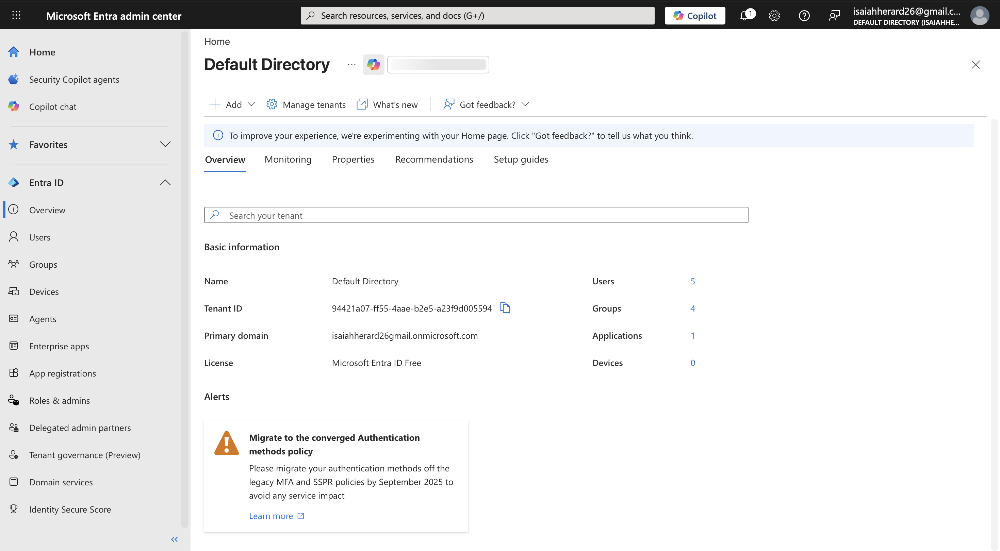

Adding a custom `meridianhealth.onmicrosoft.com` subdomain to make user UPNs read more cleanly was attempted but blocked by tenant licensing. See [Lessons Learned](#lessons-learned) for the full story and the workaround.

---

## Baseline Workforce

Fifteen employees were imported in a single bulk operation via **Identity → Users → All users → Bulk create**, using a CSV file in Entra's bulk import format. The CSV included display name, UPN, initial password, job title, department, office location, address, and phone numbers — the same identity attributes that HRIS systems push into IAM platforms during real onboarding integrations.

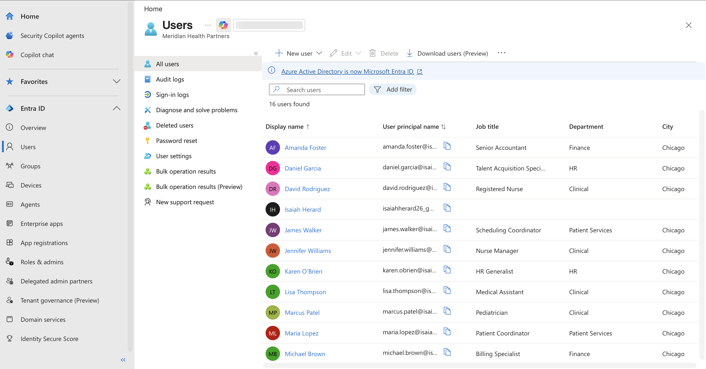

| Department | Users | Count |
|---|---|---|
| Clinical | Sarah Chen, Marcus Patel, Jennifer Williams, David Rodriguez, Lisa Thompson | 5 |
| IT | Robert Kim, Priya Sharma, Thomas Mitchell | 3 |
| Finance | Amanda Foster, Michael Brown | 2 |
| HR | Karen O'Brien, Daniel Garcia | 2 |
| Patient Services | Maria Lopez, James Walker | 2 |
| Administration | Rachel Davis | 1 |

The full CSV source is available in [`data/baseline-users.csv`](data/baseline-users.csv) for review.

---

## Group Structure

Six assigned security groups were created in **Identity → Groups → All groups** to mirror Meridian's organizational structure. All groups use the `MHP-` prefix to namespace them and keep them filterable in larger directories. Every baseline user was added to the group matching their department.

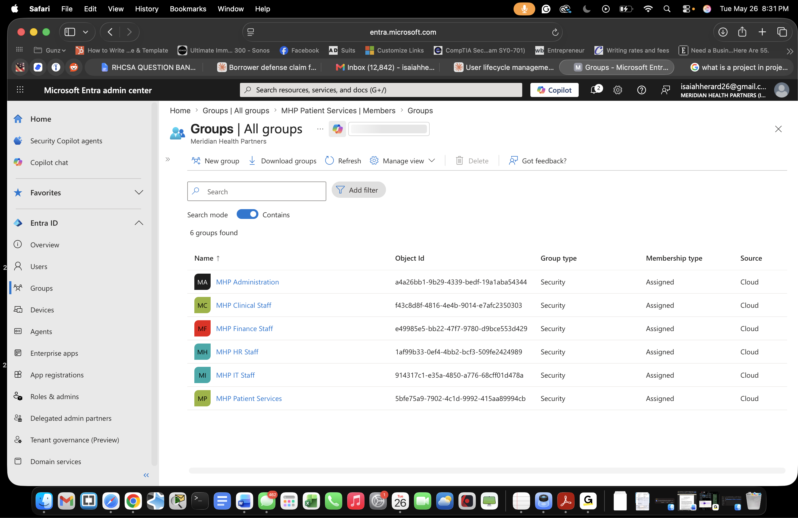

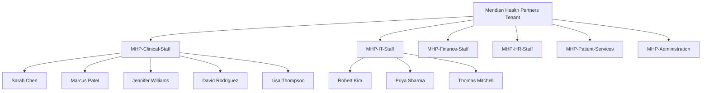

Group-based assignment is the only way users receive access in this design. No direct user-to-resource permissions exist anywhere. This is the foundation that Project 2 (RBAC Design) builds on.

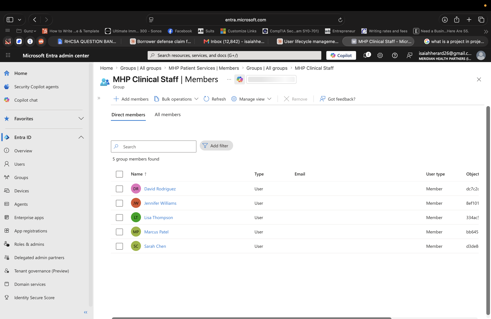

---

## Joiner: Onboarding Emily Rodriguez

**Scenario:** Emily Rodriguez is a new Registered Nurse starting at Meridian Health Partners on May 27, 2026. HR has sent the onboarding ticket to the IAM team. The goal is to provision her account, grant Clinical Staff access, and confirm she's ready for day one.

**Actions:**
- Created her user account via **Identity → Users → New user → Create new user**
- Used **auto-generate password** rather than setting one manually — IAM analysts should never know user passwords
- Populated job information: Registered Nurse, Clinical department, Tower A - Floor 4
- Set hire date to May 27, 2026 (this attribute is what scheduled offboarding workflows trigger off of in larger environments)
- Added Emily to **MHP-Clinical-Staff**

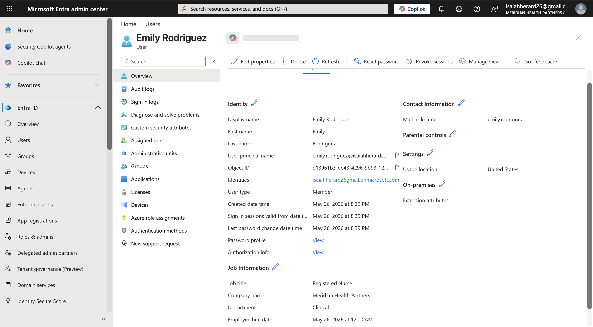

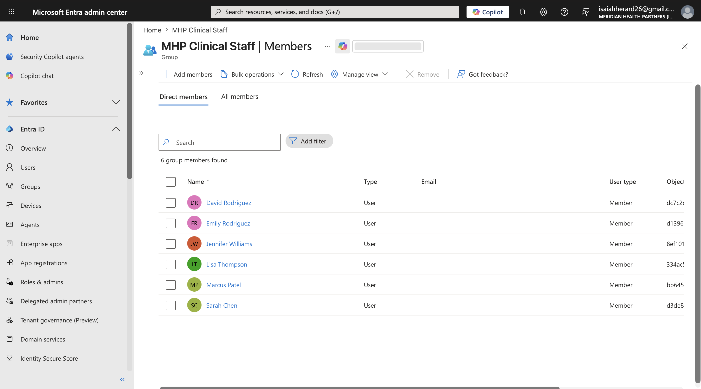

After completion, Clinical-Staff went from 5 to 6 members, and Emily has the access she needs for her role and nothing more.

---

## Mover: Promoting Jennifer Williams

**Scenario:** Jennifer Williams has been a Nurse Manager in Clinical. Effective May 27, 2026, she's been promoted into IT as Identity Operations Lead — a real career pivot across departments. Her access must reflect the new role: revoke clinical-staff access, grant IT-staff access, update job information.

This is the scenario that separates competent IAM analysts from sloppy ones. Adding the new access is easy. **Remembering to remove the old access is the test.** Forgotten access from prior roles is one of the most common audit findings in any organization.

**Before:**

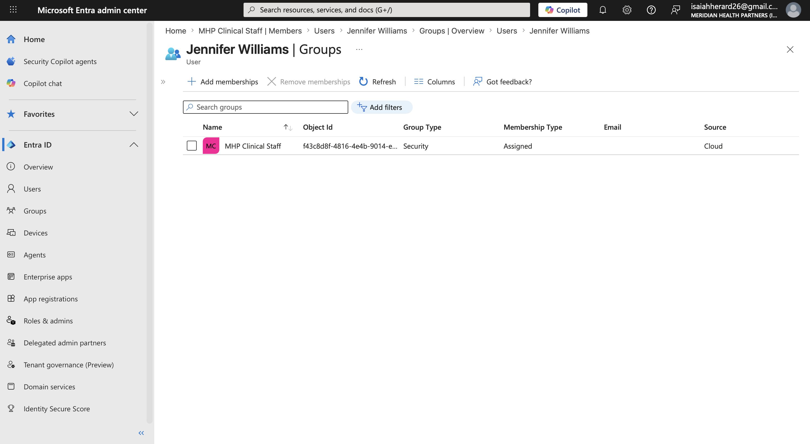

**Actions:**
- Updated job title from `Nurse Manager` to `Identity Operations Lead`
- Updated department from `Clinical` to `IT`
- Updated office location from `Tower A - Floor 4` to `Tower B - Floor 7`
- **Removed** Jennifer from `MHP-Clinical-Staff` (least privilege: she no longer needs this access)
- **Added** Jennifer to `MHP-IT-Staff`

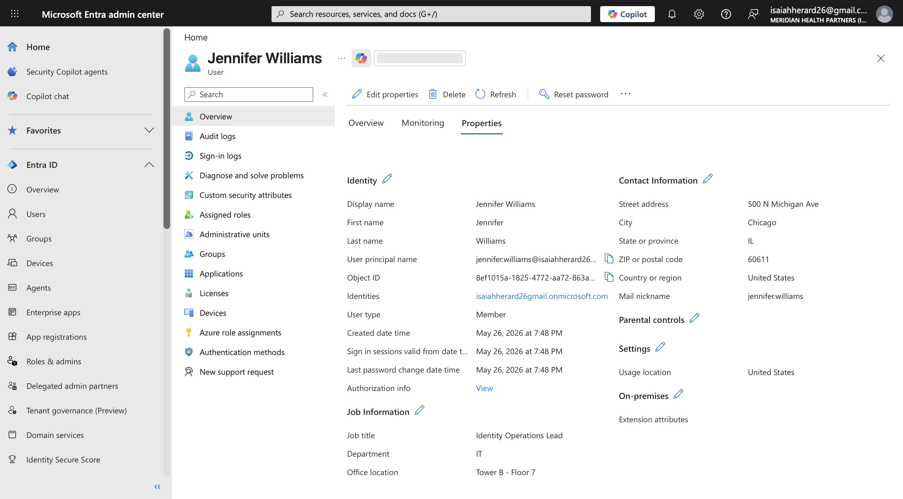

**After:**

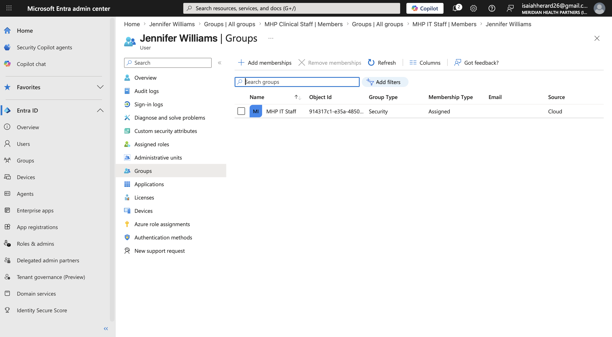

Group counts also tell the story: MHP-Clinical-Staff returned to 5 members, MHP-IT-Staff grew from 3 to 4.

---

## Leaver: Terminating Michael Brown

**Scenario:** Michael Brown, Billing Specialist in Finance, has been terminated effective immediately on May 27, 2026. Per Meridian's offboarding policy, his identity must be deactivated, all active sessions revoked, group memberships stripped, and the account soft-deleted with a 30-day recovery window before permanent removal.

This is the most security-critical scenario. Order of operations matters here because the wrong sequence creates windows where an attacker (or a disgruntled employee) can still authenticate. The correct order:

1. **Block sign-in first** — stops new authentications immediately
2. **Revoke active sessions** — invalidates existing refresh tokens; without this, current sessions remain valid for up to 90 minutes
3. **Strip group memberships** — protects against the scenario where sign-in gets re-enabled by mistake or insider threat
4. **Soft-delete** — moves to recoverable state for 30 days

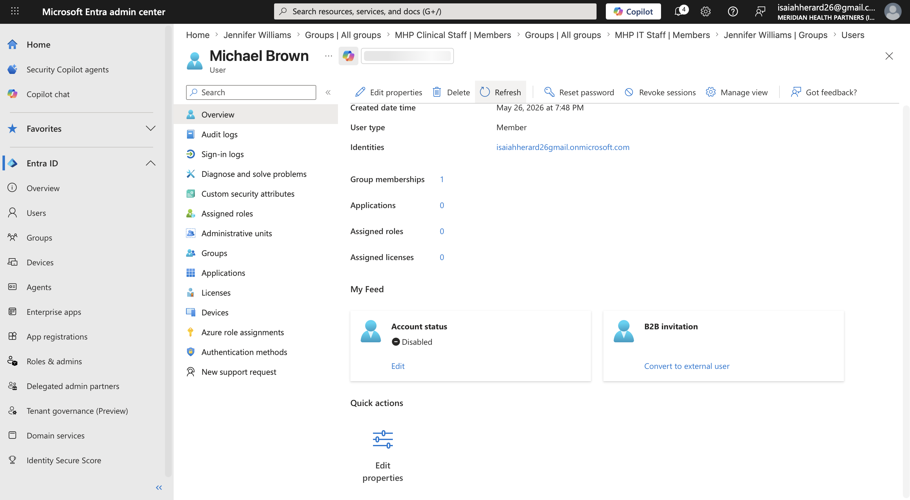

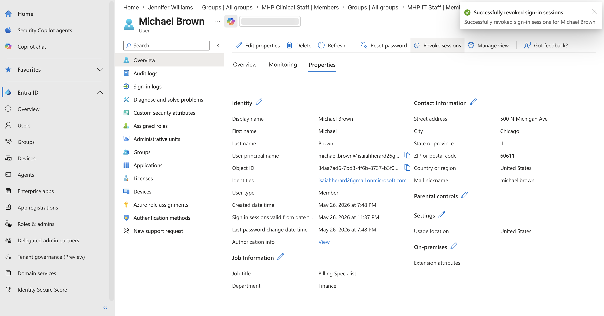

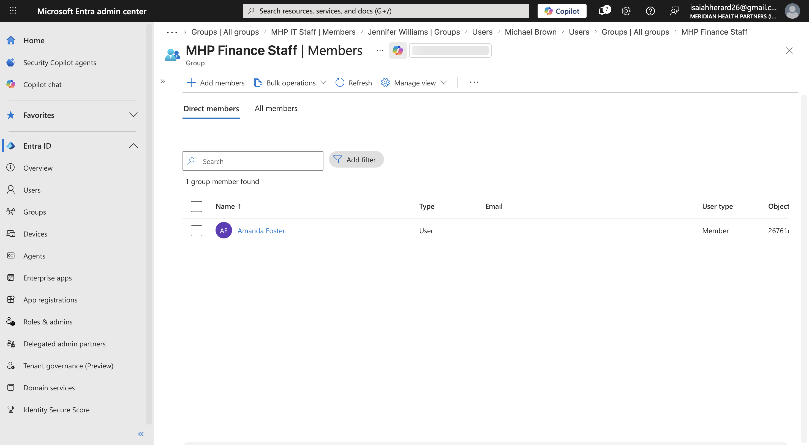

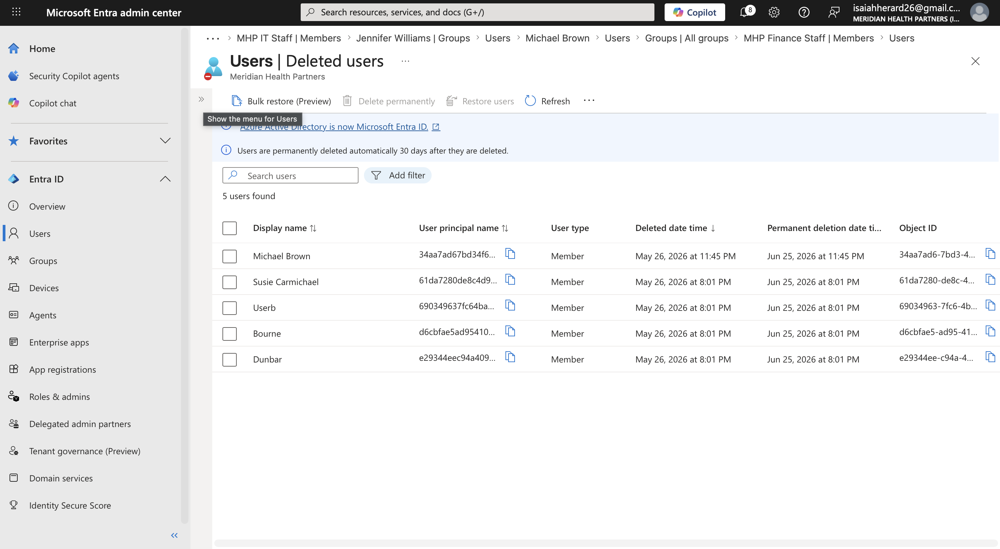

The 30-day soft-delete window matches real enterprise offboarding policy. It gives HR time to recover email, OneDrive files, and any business data the terminated employee owned. After 30 days, Entra permanently deletes the account.

---

## Audit Evidence

Every action above generated entries in the Entra audit log. The audit log is filterable by date, category, and actor, and it's what compliance auditors review during a HIPAA, SOC 2, or ISO 27001 assessment.


The captured log entries cover:

- User creation (Emily Rodriguez)
- User property updates (Jennifer Williams)
- Group membership additions and removals (all three scenarios)
- Account disablement (Michael Brown)
- Account deletion (Michael Brown)

For real-world deployments these logs would feed into a SIEM (Sentinel, Splunk, etc.) for long-term retention and correlation with other security events. That work is scoped to Project 8 (Identity Monitoring & Anomaly Detection) later in this portfolio.

---

## Skills Demonstrated

- Microsoft Entra ID administration (tenant configuration, user management, group management)
- Bulk user provisioning via CSV import
- Identity lifecycle management (Joiner / Mover / Leaver)
- Role-based access control (RBAC) via security groups
- Principle of least privilege enforcement during role transitions
- Account deactivation, session revocation, and soft-deletion workflows
- Audit log review and evidence capture for compliance
- Healthcare-specific IAM considerations (HIPAA-aligned access controls)
- IAM operational documentation

---

## Lessons Learned

Real IAM work hits real platform limits. This project surfaced four of them, and the workarounds are part of the skill.

**Microsoft 365 Developer Program no longer freely accessible.** The standard recommendation for a free Entra lab was to sign up for the M365 Developer Program, which provided a sandbox tenant with E5 licenses. Microsoft restricted this in 2024 to Visual Studio Professional/Enterprise subscribers and AI Cloud Partner Program members. I had to pivot to an Azure free account, which still provides a free Entra ID tier with all the functionality this project needed.

**Adding custom `.onmicrosoft.com` subdomains requires a Microsoft 365 license.** I wanted the user UPNs to read `firstname.lastname@meridianhealth.onmicrosoft.com` for narrative cleanliness. The Entra admin center pointed me to `admin.microsoft.com` to make that change. The M365 admin center requires at least one M365 paid license attached to the tenant, which an Azure-free tenant doesn't have. Decision: skip the cosmetic change, move forward with the auto-generated tenant domain. The lab functionality is unaffected.

**Entra bulk-create CSV ignores attributes outside the standard template.** I assumed I could add a `companyName` column to the bulk import CSV and have it populate. Microsoft's documentation confirms additional columns are silently ignored. To populate Company name in bulk requires Microsoft Graph PowerShell, which is the topic of Project 10. For Project 1, this attribute was left blank rather than manually editing 15 users.

**Default Entra UI hides job attributes.** After bulk import I couldn't initially see Job title or Department on the All Users list — the data imported correctly but the default view doesn't include those columns. The fix is `Manage view → Edit columns` to add them. Additionally, the user profile **Overview** tab shows only basic identity fields; **Properties** is where the rich job information lives. Both are non-obvious for first-time Entra admins and worth knowing.

---

## Repository Contents

```
entra-user-lifecycle-jml/
├── README.md                           # This file
├── data/
│   └── baseline-users.csv              # CSV source for bulk import
└── screenshots/                        # All evidence captures
    ├── 01-entra-overview-fresh-tenant.png
    ├── 02-baseline-users-imported.png
    ├── 03-groups-all-mhp-groups.png
    ├── 03-groups-clinical-staff-members.png
    ├── 04-joiner-emily-profile-created.png
    ├── 04-joiner-emily-added-to-clinical.png
    ├── 05-mover-jennifer-before-groups.png
    ├── 05-mover-jennifer-properties-edit.png
    ├── 05-mover-jennifer-after-groups.png
    ├── 06-leaver-michael-block-signin.png
    ├── 06-leaver-michael-revoke-sessions.png
    ├── 06-leaver-michael-finance-removed.png
    ├── 06-leaver-michael-deleted-users.png
    └── 07-audit-jml-activity-log.png
```

---

**Built by Isaiah Herard** — IAM Analyst | Microsoft SC-300 Identity and Access Administrator
[Portfolio hub](https://github.com/ZayLinux26/iam-analyst-portfolio) | [LinkedIn](https://www.linkedin.com/in/YOUR-HANDLE)

